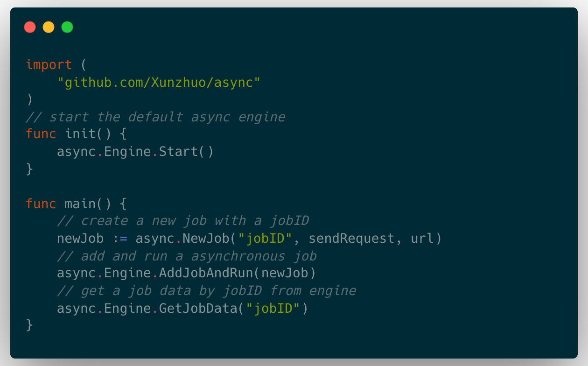

<div id="top"></div>


[![Contributors][contributors-shield]][contributors-url]
[![Forks][forks-shield]][forks-url]
[![Stargazers][stars-shield]][stars-url]
[![Issues][issues-shield]][issues-url]
<!-- [![Apache License][license-shield]][license-url] -->


<!-- PROJECT LOGO -->
<br />
<div align="center">
  <a href="https://github.com/Xunzhuo/async">
    
  </a>

<h1 align="center"> Async </h3>

  <p align="center">
    Async is a lightwight, easy-to-use, high performance, more human-being Asynchronous Engine
  </p>
</div>


<!-- TABLE OF CONTENTS -->
<details>
  <summary>Table of Contents</summary>
  <ol>
    <li>
      <a href="#about-the-project">About The Project</a>
      <ul>
        <li><a href="#architecture">Architecture</a></li>
        <li><a href="#built-with">Built With</a></li>
      </ul>
    </li>
    <li>
      <a href="#getting-started">Getting Started</a>
      <ul>
        <li><a href="#prerequisites">Prerequisites</a></li>
        <li><a href="#installation">Installation</a></li>
      </ul>
    </li>
    <li><a href="#usage">Usage</a></li>
    <li><a href="#roadmap">Roadmap</a></li>
    <li><a href="#contributing">Contributing</a></li>
    <li><a href="#license">License</a></li>
    <li><a href="#contact">Contact</a></li>
    <li><a href="#acknowledgments">Acknowledgments</a></li>
  </ol>
</details>


<!-- ABOUT THE PROJECT -->
## About this Project

Async is a lightwight, easy-to-use, high performance, more human-being Asynchronous Engine

### Spotlights

+ Async is very easy to use, creating the jobs just by a couple of lines.
+ Provide powerful options to control the jobs like the MaxNumber of WorkQueue.
+ Provide inner cache to speed up to get the cached jobs data.
+ Help you easily manage your jobs into asynchronous way like:
    + reducing the time like the long time of http response in large number of requests
    + reducing the time like when interating with DataBase to query SQL
    + reducing ....

<!-- GETTING STARTED -->
## Getting Started

<div align="center">

</div>

### Installation

``` go
  go get github.com/Xunzhuo/async
```

#### Built with

* [Golang](https://go.dev/)
* [Docker](https://www.docker.com/)
* [Docker-Compose](https://docs.docker.com/compose/)

<!-- USAGE EXAMPLES -->
## Usage

<!-- ROADMAP -->
## Roadmap

See the [open issues](https://github.com/Xunzhuo/async/issues) for a full list of proposed features (and known issues).


<!-- CONTRIBUTING -->
## Contributing

Contributions are what make the open source community such an amazing place to learn, inspire, and create. Any contributions you make are **greatly appreciated**.

If you have a suggestion that would make this better, please fork the repo and create a pull request. You can also simply open an issue with the tag "enhancement".
Don't forget to give the project a star! Thanks again!

1. Fork the Project
2. Create your Feature Branch (`git checkout -b feature/AmazingFeature`)
3. Commit your Changes (`git commit -m 'Add some AmazingFeature'`)
4. Push to the Branch (`git push origin feature/AmazingFeature`)
5. Open a Pull Request

<!-- LICENSE -->
## License

Distributed under the Apache 2.0 License. See `LICENSE` for more information.

<!-- CONTACT -->
## Contact

Project Link: [https://github.com/Xunzhuo/async](https://github.com/Xunzhuo/async)


<!-- ACKNOWLEDGMENTS -->
## Acknowledgments


<!-- MARKDOWN LINKS & IMAGES -->
<!-- https://www.markdownguide.org/basic-syntax/#reference-style-links -->
[contributors-shield]: https://img.shields.io/github/contributors/Xunzhuo/async.svg?style=for-the-badge
[contributors-url]: https://github.com/Xunzhuo/async/graphs/contributors
[forks-shield]: https://img.shields.io/github/forks/Xunzhuo/async.svg?style=for-the-badge
[forks-url]: https://github.com/Xunzhuo/async/network/members
[stars-shield]: https://img.shields.io/github/stars/Xunzhuo/async.svg?style=for-the-badge
[stars-url]: https://github.com/Xunzhuo/async/stargazers
[issues-shield]: https://img.shields.io/github/issues/Xunzhuo/async.svg?style=for-the-badge
[issues-url]: https://github.com/Xunzhuo/async/issues
